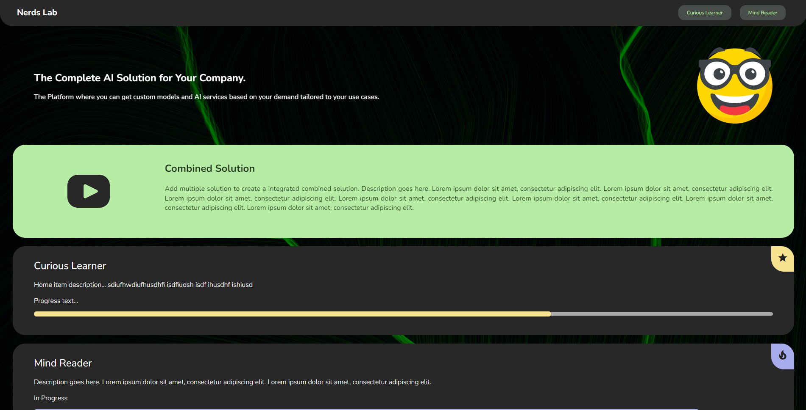
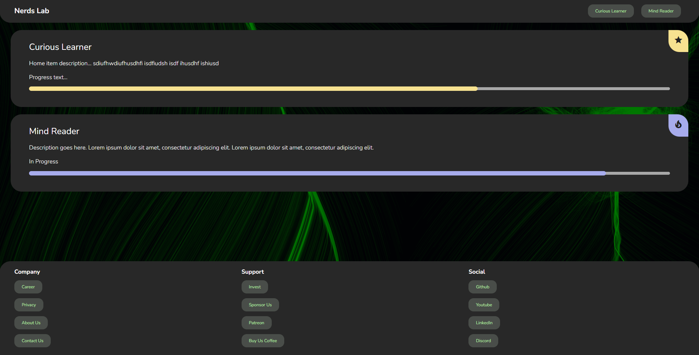
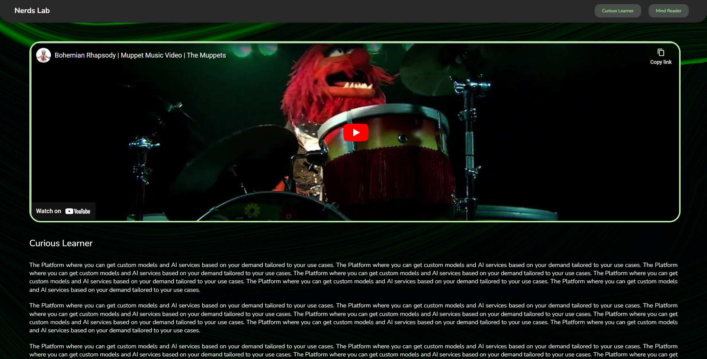
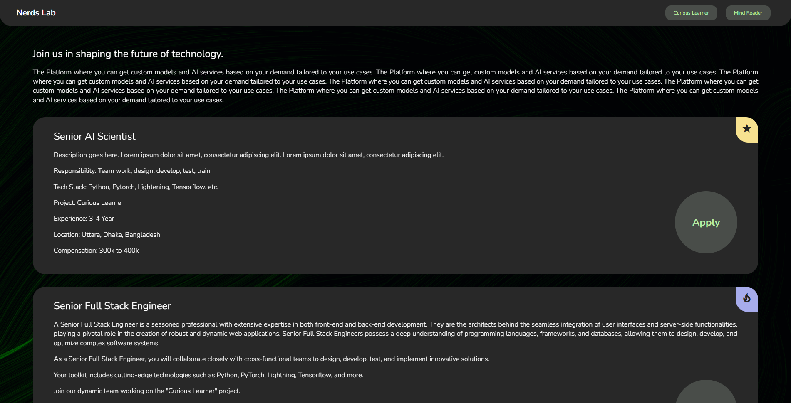
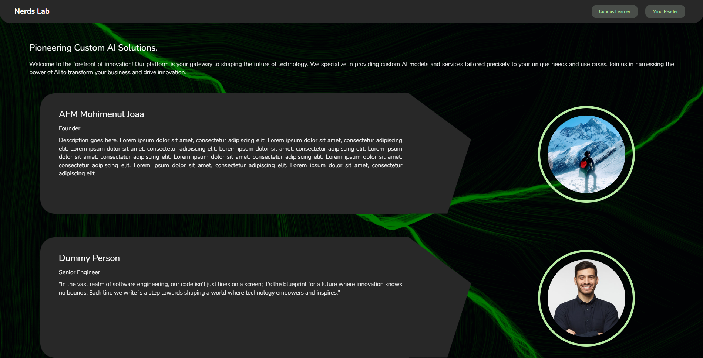
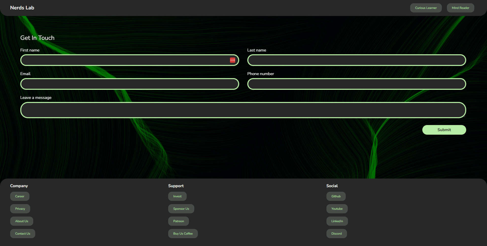
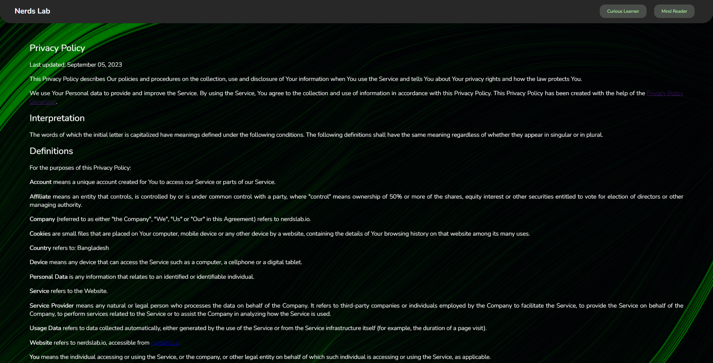

## NerdsLab Website using Experience by Kentico

NerdsLab is your one-stop platform for custom AI solutions tailored to your company's needs. This Kentico-powered website features seven essential pages designed to showcase our products, services, and company philosophy.


### 1. Home Page


The Home page is where visitors get an overview of our offerings, including featured items and products.

### 2. Products Page


The Products page provides a comprehensive list of all our AI products.

### 3. Product Page


On the Product page, users can see detailed demonstrations of individual products.

### 4. Career Page


Our Career page outlines our company philosophy and lists current job openings.

### 5. About Us Page


Learn about our company, mission, and values on the About Us page.

### 6. Contact Us Page


Need to get in touch? Visit our Contact Us page for various communication options.

### 7. Privacy Page


Understand how we handle your data by reviewing our Privacy page.

## Getting Started

To run this project locally, follow these instructions:

1. Clone this repository:
   ```bash
   git clone https://github.com/yourusername/nerdslab-website.git
   ```
   
2. Open terminal and navigate to project folder
3. Run the following command & enjoy
   ```bash  
   dotnet run
   ```

